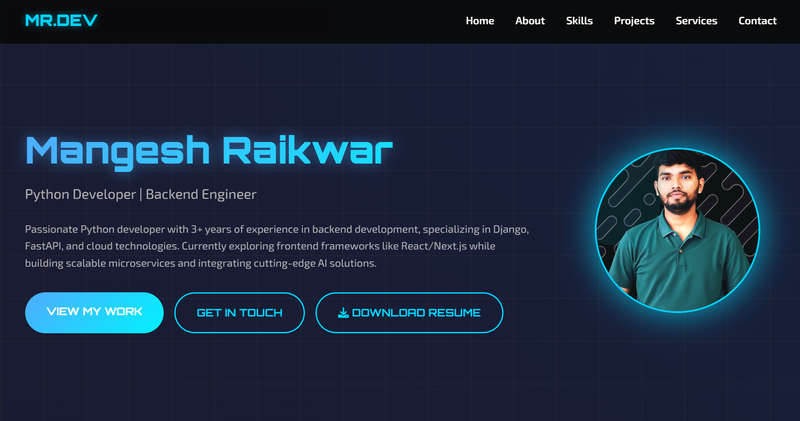
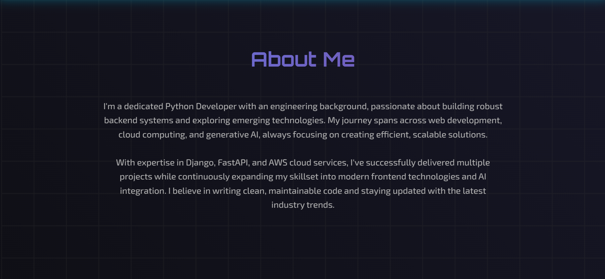
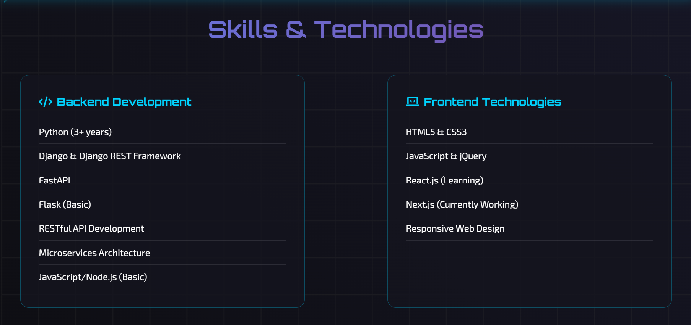
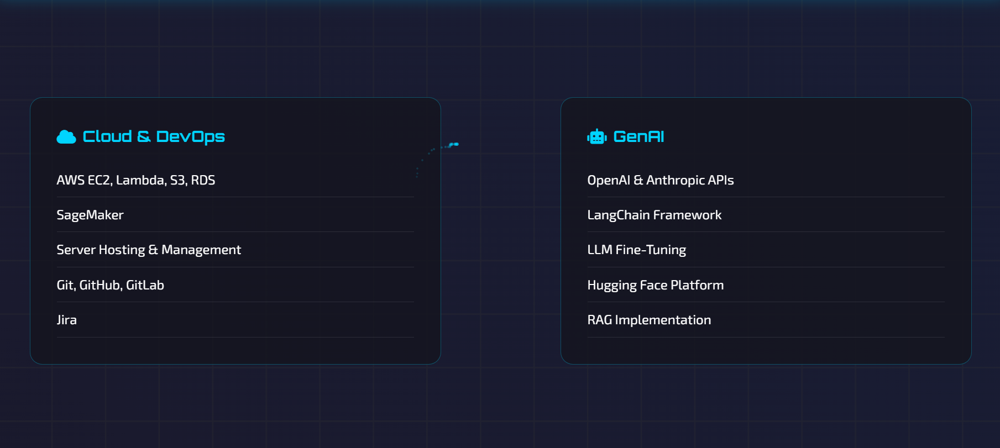
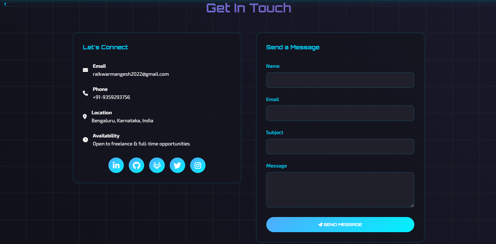
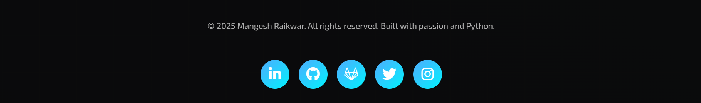

# 💻 Mangesh Raikwar - Fullstack-Developer Portfolio

[](https://www.python.org/)
[](https://fastapi.tiangolo.com/)
[](https://opensource.org/licenses/MIT)

## 🚀 Overview

A modern, responsive portfolio website built with Python (FastAPI) and HTML, CSS, and JavaScript. This portfolio showcases my skills, services, and contact information in an elegant, interactive interface designed to showcase my potential.










## ✨ Features

- 🎨 Modern, responsive design with animated backgrounds
- 🌙 Clean and professional UI/UX
- 📱 Mobile-friendly layout
- 🔍 Sections for skills, services, and contact information
- 🔗 Social media integration
- 📄 Resume download functionality
- 🚀 Fast loading and performance optimized

## 🛠️ Tech Stack

- **Backend**: Python, FastAPI, Uvicorn
- **Frontend**: HTML5, CSS3, JavaScript
- **Templating**: Jinja2
- **Icons**: Font Awesome
- **Fonts**: Google Fonts (Orbitron, Exo 2)

## 🗂️ Project Structure

```
MyPortfolio-/
├── portfolio/
│   ├── static/
│   │   ├── css/
│   │   │   └── styles.css
│   │   ├── js/
│   │   │   └── script.js
│   │   └── images/
│   │       └── 1747376772419.jpg
│   ├── templates/
│   │   └── index.html
│   ├── main.py
│   └── requirements.txt
├── requirement.txt
└── README.md
```


## 💼 Professional Skills

- **Languages**: Python, JavaScript
- **Frameworks**: Django, FastAPI, Flask
- **Frontend**: HTML, CSS, React/Next.js
- **Databases**: PostgreSQL, MongoDB, Redis
- **DevOps**: Docker, AWS, CI/CD
- **GenAI**: OpenAI & Anthropic APIs, LangChain, Hugging Face, RAG Implementation

## 📞 Contact

**Feel free to reach out for collaboration or job opportunities!**

- **Email:** raikwarmangesh2022@gmail.com  
- **Mobile:** +91-9359293756


---

<p align="center">Built with ❤️ by Mangesh Raikwar</p>
