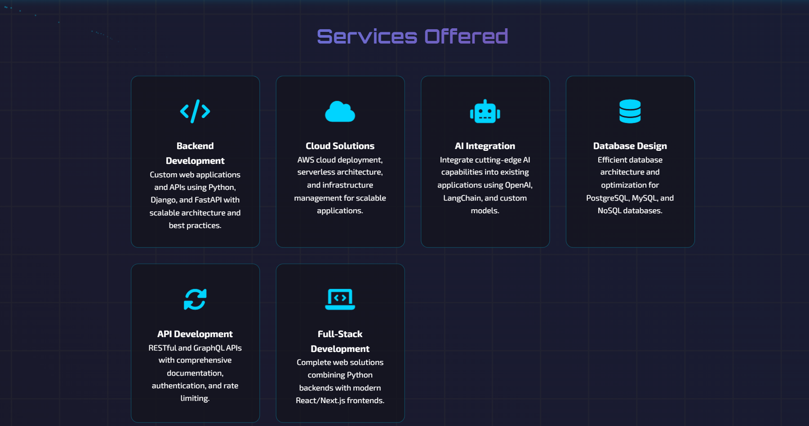

# 💻 Mangesh Raikwar - Fullstack-Developer Portfolio

## 🚀 Overview

A modern, responsive portfolio website built using Python (FastAPI), along with HTML, CSS, and JavaScript. It presents my skills, services, and contact details through an elegant, interactive interface designed to effectively highlight my capabilities.

## ✨ Features

- 🎨 Modern, responsive design with animated backgrounds
- 🌙 Clean and professional UI/UX
- 📱 Mobile-friendly layout
- 🔍 Sections for skills, services, and contact information
- 🔗 Social media integration
- 📄 Resume download functionality
- 🚀 Fast loading and performance optimized

## 🛠️ Tech Stack

- **Backend**: Python, FastAPI, Uvicorn
- **Frontend**: HTML5, CSS3, JavaScript
- **Templating**: Jinja2
- **Icons**: Font Awesome
- **Fonts**: Google Fonts (Orbitron, Exo 2)

## 💼 Professional Skills

- **Languages**: Python, JavaScript
- **Frameworks**: Django, FastAPI, Flask
- **Frontend**: HTML, CSS, React/Next.js
- **Databases**: PostgreSQL, MongoDB, Redis
- **DevOps**: Docker, AWS, CI/CD
- **GenAI**: OpenAI & Anthropic APIs, LangChain, Hugging Face, RAG Implementation

## 📞 Contact

**Feel free to reach out for collaboration or job opportunities!**

- **Email:** raikwarmangesh2022@gmail.com  
- **Mobile:** +91-9359293756

---

Built with ❤️ by Mangesh Raikwar

